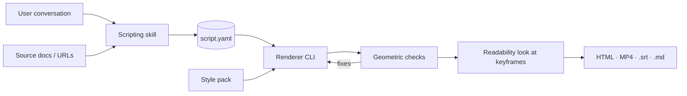

# Animated Explainer Pipeline — MVP PRD & Build Brief

*Revision 2. The changes from the first draft, and why, are listed in [Revisions](#revisions) at the end.*

## Overview

The MVP turns a natural conversation about a process into a short animated flowchart, rendered in either a pencil-sketch or a standard flowchart-icon style. It has two components joined by a written script: a scripting skill that works with the user to decide what to show, and a renderer that plays the script through a style pack.

**Problem.** AI video tools produce attractive output that is inaccurate, hard to edit and impossible to version. Explaining a process (a workflow, a tool, a system) needs clarity and correctness more than realism, and hand-built animations are expensive to make and to keep current.

**Approach.** Treat an explainer as a graph that changes over time. The script records what each thing *is* and the order it is revealed; a style pack decides how it *looks* and *moves*. The same script can be re-rendered in another style, edited by hand, or regenerated when the source material changes.

**Test case.** How Matt Pocock's [Wayfinder skill](https://www.aihero.dev/skills-wayfinder) works, rendered in both MVP styles from one script.

**Status quo.** The nearest existing tool is archify (SVG workflow diagrams with trace motion and WebM export). What it lacks is exactly this product's reason to exist: steps tied to narration, swappable styles, and citations. Anything archify already does well is not worth rebuilding by accident.

## MVP scope

The MVP covers one genre (process and concept flowcharts) in two styles (pencil sketch, standard flowchart icons), with the Wayfinder explainer as the single acceptance test.

| In scope | Out of scope (later phases) |
| --- | --- |
| Conversational scripting skill that outputs a validated script | Mechanism explainers (moving parts, e.g. the water pump) |
| Script schema v0.1 (graph + states + steps + narration + quoted citations) | Technical-parts style and per-subject asset generation |
| Pencil-sketch style pack | Photorealism, characters, lip-sync |
| Standard flowchart-icon style pack | TTS voice-over audio |
| Renderer CLI: validate, lay out, render, capture, check | CAD or engineering-drawing import |
| Outputs: step-through HTML, MP4, captions (.srt), narration (.md) | GIF and thumbnail exports (one ffmpeg line each when wanted) |
| Source grounding: every node, edge and narration line cites a source with a verbatim quote | Branding templates, multi-agent production pipeline |
| | Automated regeneration when sources change |

**Primary user for the MVP:** Andrew, as a PM explaining tools and processes. Wider users (trainers, architects, writers) are assumed to share the need but are not tested yet.

## Architecture

Two independent components share one contract: the script file. Neither imports the other; the script on disk is the handoff, so either side can be rerun, swapped or hand-edited. The scripting skill may *run* the renderer CLI on a draft script (for the Checkpoint 2 sample frame), which keeps the file as the only interface.



**Principles**

- **Script is the source of truth.** Rendered files are disposable build output and are never committed; the script and style pack are what get versioned.
- **Content and style never mix.** The script names semantic types (decision ticket, blocking edge, fogged state); only the style pack knows what those look like.
- **Steps are diffs, not scenes.** Each step changes graph state (reveal, highlight, change state, annotate). Video and step-through HTML render from the same steps.
- **The player is a pure function of time.** `seek(t)` draws exactly the frame at time `t`. Autoplay, stepping and video capture all go through it, so nothing depends on wall-clock timing.
- **Grounded by default.** Every node, edge and narration line carries a citation with a verbatim quote that the validator checks against the stored source.
- **Fail loudly.** The renderer rejects a script that fails schema or coverage validation rather than improvising.
- **Deterministic where possible, a model only where judgement is needed.** Validation, layout, rendering, capture and geometric checks are ordinary code under `tdd`. A model looks at the result only for readability.

## Component 1: Scripting skill

A Claude Code skill (working name `/explainer-script`) that turns a conversation into a validated `script.yaml`. It proposes, the user steers, it moves on: short loops, never a long upfront questionnaire.

**Conversation flow**

1. **Intent.** Capture audience and one outcome sentence: "after watching, the viewer understands X." Target duration defaults to 60–90 seconds.
2. **Grounding.** Ask for source material (repo files, URLs, notes), fetch it and store extracts (see [Sources and licensing](#sources-and-licensing)). Refuse to invent facts the sources do not support; flag gaps as open questions instead. Every claim that later reaches the script carries a verbatim quote from an extract.
3. **Concept map.** Propose node types, states, nodes and edges. Show the end-state as a Mermaid diagram for the user to react to. **Checkpoint 1: user approves the graph.**
4. **Style.** User picks a style pack. The skill writes the draft script and runs the renderer CLI for one sample frame of the end-state (`render --frame end`). **Checkpoint 2: user approves the look.**
5. **Sequencing.** Propose the reveal order step by step, each with its narration line and duration. Choreograph special effects (e.g. fog-of-war) here.
6. **Tightening.** Check total duration, flag any step over the action limit, cut anything the outcome sentence does not need.
7. **Emit.** Write `script.yaml`, validate it against the schema, and print a one-screen human summary. **Checkpoint 3: user approves the script.**

**Behaviors**

- **Resumable.** Saves `script.draft.yaml` after every checkpoint; reopening the skill offers to resume.
- **Incremental.** One decision per turn where possible; shows a proposal rather than asking an open question.
- **Edit-in-place.** Can be pointed at an existing script to revise one section (e.g. "re-sequence steps 4–7") without redoing the rest.
- **Self-contained.** Skill folder holds `SKILL.md` and a pointer to the schema, the worked example (the Wayfinder script) and the validator in the renderer CLI.

## Script schema v0.1

A script is YAML with five parts: metadata, sources, graph, steps and style hints. It is validated with a JSON Schema plus a small set of cross-reference checks the schema cannot express (ids resolve, quotes match). The renderer rejects anything that fails.

| Section | Holds | Rules |
| --- | --- | --- |
| `meta` | schema version, title, audience, outcome sentence, target duration (s) | `schema: 0.1` required |
| `sources` | id, title, url and/or file path, fetched date, pinned version where one exists | all fields but one of url/path required; every citation must resolve here |
| `graph.node_types` | semantic types used (e.g. `hub`, `ticket.grilling`) | style packs must map every type |
| `graph.edge_kinds` | edge kinds used (`flow`, `blocks`, `contains`) | style packs must map every kind |
| `graph.states` | node states used (e.g. `fogged`, `open`, `claimed`, `resolved`) | style packs must map every state; `set_state` may only use declared states |
| `graph.nodes` / `graph.edges` | id, type, label (≤ 30 chars), group, `cite` | edges: `from`, `to`, `kind`, `cite` — no uncited edges |
| `steps` | ordered list of actions, narration, duration (s), `cite` | ≤ 3 actions per step; one action may target several nodes |
| `style_hints` | optional per-node icon or emphasis hints | never required; packs may ignore |

**Citations.** A `cite` is either a source id or `{src, quote}`. Nodes, edges and narration lines must use the `{src, quote}` form. The validator checks that each `quote` appears in that source's stored extract, after normalizing whitespace, case and Markdown emphasis or code marks. A citation proves only that a source was named; the quote proves the source actually says it.

**Step actions (v0.1 vocabulary):** `reveal`, `hide`, `highlight`, `unhighlight`, `set_state`, `annotate` (callout text), `focus` (camera zoom to a group), `pause`. Each action targets one node id, a list of ids, or a group. **The action limit is one rule, stated once:** at most 3 actions per step, where revealing four tickets in one list is one action. It exists to bound what the viewer must take in at once, which a single "reveal the first four tickets" does not exceed.

**Excerpt (Wayfinder)**

```yaml
meta:
  schema: 0.1
  title: How Wayfinder charts a big project
  audience: PMs and engineers new to agent skills
  outcome: Viewer understands map, ticket types, blocking and the frontier
  duration_s: 75
sources:
  - id: aihero
    title: The /wayfinder Skill — AI Hero
    url: https://www.aihero.dev/skills-wayfinder
    fetched: 2026-09-25
  - id: skillmd
    title: wayfinder SKILL.md (mattpocock/skills, MIT)
    url: https://github.com/mattpocock/skills/blob/ed37663/skills/engineering/wayfinder/SKILL.md
    path: examples/wayfinder/sources/wayfinder-SKILL.md
    version: ed37663
    fetched: 2026-09-25
graph:
  node_types: [goal, region, hub, ticket.grilling, ticket.prototype, ticket.research, ticket.task, session]
  edge_kinds: [contains, blocks]
  states: [fogged, open, claimed, resolved]
  nodes:
    - id: goal
      type: goal
      label: "Destination"
      cite: {src: skillmd, quote: "naming it is the first act of charting"}
    - id: route
      type: region
      label: "The way there"
      cite: {src: skillmd, quote: "wrapped in fog: the way from here to the destination isn't visible yet"}
    - id: map
      type: hub
      label: "Map (wayfinder:map)"
      cite: {src: skillmd, quote: "The map is a single issue on this repo's issue tracker, labelled `wayfinder:map`"}
    - id: t1
      type: ticket.grilling
      label: "Grill: scope"
      group: first-tickets
      cite: {src: skillmd, quote: "Conversation via the /grilling and /domain-modeling skills"}
    - id: t2
      type: ticket.research
      label: "Research: options"
      group: first-tickets
      cite: {src: skillmd, quote: "Reading documentation, third-party APIs"}
  edges:
    - from: map
      to: t1
      kind: contains
      cite: {src: skillmd, quote: "Its tickets are child issues of the map."}
    - from: t1
      to: t2
      kind: blocks
      cite: {src: skillmd, quote: "Blocking uses the tracker's native dependency relationship"}
steps:
  - actions: [{reveal: goal}, {reveal: route}, {set_state: {route: fogged}}]
    narration: "You know where you want to end up, but not the route."
    duration_s: 5
    cite: {src: skillmd, quote: "the way from here to the destination isn't visible yet"}
  - actions: [{reveal: map}, {annotate: {map: "One issue holds the map"}}]
    narration: "Wayfinder starts a single map issue on your tracker."
    duration_s: 6
    cite: {src: skillmd, quote: "The map is a single issue on this repo's issue tracker"}
  - actions: [{reveal: first-tickets}]
    narration: "Its first tickets are typed: grilling, prototype, research, task."
    duration_s: 6
    cite: {src: skillmd, quote: "Each ticket carries a `wayfinder:<type>` label"}
```

*`route` is a `region` node standing for the unexplored space between here and the destination. The destination itself is never fogged: in Wayfinder it is named first, and the fog lies over the way to it.*

## Style packs

A style pack is a folder the renderer loads: a mapping from semantic types, edge kinds and states to visuals, plus a motion vocabulary that defines how each step action looks. Both MVP packs must render the full Wayfinder script with no script changes.

| Element | Pencil sketch | Standard flowchart icons |
| --- | --- | --- |
| Nodes | Hand-drawn boxes and circles with slight wobble (rough.js strokes) | BPMN-style shapes: rounded rect, diamond, cylinder, document |
| Edges | Sketched arrows, hand-lettered labels | Clean orthogonal connectors, arrowheads by edge kind |
| Type distinction | Hatching patterns and hand-drawn glyphs per ticket type | Consistent icon set + categorical color per ticket type |
| Typography | Handwriting-style font, bundled | Neutral sans-serif, bundled |
| Background | Paper texture, off-white | Flat, light or dark theme |
| `reveal` | Stroke draws itself on, as if being sketched | Fade and scale in |
| `highlight` | Scribbled circle or underline | Color pulse and glow |
| `set_state: fogged` | Graphite smudge over the node or group | Grayed out at 30% opacity |
| Idle motion | Subtle "line boil" (strokes redrawn with small variations, ~8 fps, seeded so `seek(t)` is deterministic) | None |

**Pack contents:** `pack.yaml` (type, edge-kind and state → visual mapping, colors, fonts, timings), glyph or icon SVGs, and motion presets. A pack fails validation if any node type, edge kind, state or action used by a script has no mapping, so missing coverage is caught before rendering.

**Design floor.** Both packs meet the floor in `.claude/my-process.md` → Design: colors as named tokens, AA contrast at the size actually rendered, ticket-type colors from a categorical palette rather than semantic colors, no runtime font fetches.

**Pencil sketch note:** true rotoscoping traces live footage; this pack imitates the hand-drawn pencil look instead, which suits diagrams and needs no source footage.

## Component 2: Renderer

A Node CLI (working name `render`) that takes `script.yaml` and a style pack and produces the output package. It is ordinary code, built test-first. Engine: an SVG + JavaScript player, captured to MP4 by stepping a headless browser through `seek(t)` and piping frames to ffmpeg, so the step-through HTML and the video come from one renderer.

**Pipeline**

1. **Validate.** Schema check on the script; cross-reference checks (ids resolve, every `cite` resolves, every `quote` is found in its extract); coverage check against the style pack. Fail with a readable error list.
2. **Layout.** Auto-layout the *final* graph once with ELK (orthogonal routing, which the standard pack needs), so nodes never jump between steps. Positions are written to `layout.json`, which the user can hand-adjust and lock. Layout runs at build time; the player only reads positions.
3. **Build player.** Generate one self-contained `explainer.html` that plays the steps with next/previous controls and an autoplay mode timed from `duration_s`, all through `seek(t)`.
4. **Capture.** Step the player frame by frame at 1920×1080, 30 fps, into `explainer.mp4`. Capture only frames that differ and let ffmpeg hold each one for its duration: a settled step in the standard pack is static, and pencil boils at only 8 fps.
5. **Narration outputs.** `narration.md` (script with citations and quotes) and `captions.srt` timed from step durations.
6. **Geometric checks.** Measured from the DOM at the end of each step (`getBBox()`): overlapping nodes or labels, text under 24 px at 1080p, steps whose animation overruns their duration. Apply fixes to layout or timing, re-render, maximum 2 loops, then report what remains in `review.md`.
7. **Readability look.** A model views one keyframe PNG per step and notes anything the geometry cannot see (a confusing arrangement, an annotation that obscures the point). Findings go into `review.md`; it does not edit the script.

**Output package** (under `out/`, gitignored)

```
out/<slug>/<style>/
  explainer.html
  explainer.mp4
  captions.srt
  narration.md
  layout.json
  review.md
```

**Performance targets:** first render under 5 minutes; re-render after a script edit under 2 minutes. The capture spike (M0) either confirms the 2-minute target or replaces it with a measured one before anything is built on it.

## Sources and licensing

This repo is public, so what gets stored is decided by licence, not convenience.

- **Wayfinder `SKILL.md`** is MIT-licensed (mattpocock/skills). It is vendored under `examples/wayfinder/sources/` with its licence notice, pinned to commit `ed37663`. The render never re-fetches it; updating the pin is a deliberate script edit.
- **Articles** (AI Hero, Latent Space, Pasquale Pillitteri) are not ours to republish. Their full extracts live in `local-data/` (gitignored); the committed script carries only the short verbatim quotes it cites. The quote check runs wherever the extracts are present, and warns rather than passes where they are not.

## Test case: Wayfinder in both styles

The MVP passes when one Wayfinder script, produced through the scripting skill, renders in both style packs and meets every criterion below.

**Sources:** the Wayfinder `SKILL.md` from mattpocock/skills (pinned, see above), the [AI Hero Wayfinder page](https://www.aihero.dev/skills-wayfinder) and the [Latent Space interview](https://www.latent.space/p/wayfinder-skill).

**Proposed story (60–90 s, ~12 steps)**

1. The destination appears, clear; the route to it is fog. The project is too big for one agent session.
2. A single map issue appears on the issue tracker.
3. The first tickets appear as children of the map, each typed: grilling, prototype, research, task (one `reveal` of the group).
4. Blocking edges connect tickets; the unblocked, unclaimed ones glow as the frontier.
5. Research tickets resolve in parallel by subagents; a session claims one other frontier ticket and resolves it into a decision. One ticket per session is the rule, and research is the exception.
6. The decision is gisted on the map; fog lifts from the next region, and what is now specifiable graduates into new tickets.
7. Repeat twice, faster, as the route to the destination becomes clear.
8. End state: resolved map, clear path, summary callouts.

**Acceptance criteria**

- [ ] Script produced via the skill in one sitting, with all three checkpoints used
- [ ] Script validates; zero uncited nodes, edges or narration lines, and every quote is found in its source
- [ ] Both styles render from the identical script with no edits
- [ ] Duration 60–90 s in both styles; captions in sync within 0.5 s
- [ ] Geometric checks report no overlaps and no text under 24 px at 1080p
- [ ] Andrew's check against the sources finds zero factual errors
- [ ] Andrew would share both versions as they stand
- [ ] Changing one label in the script and re-rendering takes under 2 minutes (or the target M0 set)

## Build sequence

Build the renderer against a hand-written script first, then build the skill that writes scripts. Each milestone ends with something Andrew can look at and steer before the next begins.

| # | Milestone | Done when |
| --- | --- | --- |
| M0 | Capture spike (throwaway) | A stub `seek(t)` player with 20 nodes is captured to a 75 s MP4 with frame deduplication; wall-clock time measured; the answer is recorded as an ADR and the code dies |
| M1 | Schema + validator + hand-written Wayfinder script | `validate script.yaml` passes; a deliberately broken script (uncited edge, undeclared state, quote not in source, 4-action step) fails with clear errors |
| M2 | Standard-icon pack + HTML step-through player | Wayfinder plays in the browser with next/previous, stable layout, all steps visible |
| M3 | Capture to MP4 + captions and narration outputs | Full output package generated for the standard style |
| M4 | Pencil-sketch pack | Same script renders in pencil style with draw-on and line boil; zero script edits |
| M5 | Geometric checks + readability look | A seeded overlap is caught and fixed within 2 loops (a unit test, not a demo) |
| M6 | Scripting skill (conversation → script) | Skill regenerates an equivalent Wayfinder script from a fresh conversation, all checkpoints hit |
| M7 | Acceptance run | Every criterion in the test case is ticked |

**Repo layout** (inside this repo, following its phase layout)

```
build/
  schema/script.schema.json
  render/                      Node CLI: validate, layout, player, capture, checks
  packs/standard/  packs/pencil/
  skill/explainer-script/SKILL.md
  examples/wayfinder/script.yaml
  examples/wayfinder/sources/  vendored MIT sources only
local-data/                    article extracts (gitignored)
out/                           rendered output (gitignored)
```

**Working rules:** no change to the schema without bumping `meta.schema` and updating the validator and example; keep the player dependency-light (pinned jsdelivr/cdnjs libraries only: elkjs, roughjs); never commit rendered output. Comparison between milestones uses a screenshot from a synthetic view in `docs/screenshots/` where one is worth keeping.

## Open decisions

Each has a proposed answer. They are to be confirmed or overturned when the effort is charted, not assumed.

| Decision | Proposed | Why |
| --- | --- | --- |
| Primary output: MP4 or HTML first? | HTML first, MP4 as a capture of it | The player *is* the renderer; video is `seek(t)` sampled 30 times a second |
| Render engine | SVG + JS player, headless capture | One renderer for both outputs; Motion Canvas or Manim would mean two |
| Where the scripting skill runs | Claude Code only | It fetches sources, writes files and runs the renderer |
| Narration in the MVP | Captions only | TTS is Phase 2 and changes nothing in the schema |
| Wayfinder updates | Pin the commit | Re-fetching on every render contradicts "the script is the source of truth" |
| Where the renderer code lives relative to the skill | Skill points at the CLI in `build/render/` | Keeps one validator; the skill folder stays text |

## Later phases

| Phase | Adds |
| --- | --- |
| 2 | TTS voice-over, branding templates, more flowchart packs |
| 3 | Mechanism genre: technical-parts style, per-subject part assets, motion model (water pump as test case) |
| 4 | Source-change detection and automatic script and render regeneration |

## Sources

- [The /wayfinder Skill — AI Hero](https://www.aihero.dev/skills-wayfinder)
- [The /wayfinder Skill: Navigating the Fog of War of Planning — Latent Space](https://www.latent.space/p/wayfinder-skill)
- [Wayfinder: plan projects too big for one session — Pasquale Pillitteri](https://pasqualepillitteri.it/en/news/12137/wayfinder-claude-code-skill-plan-big-projects)
- [wayfinder SKILL.md — mattpocock/skills @ ed37663](https://github.com/mattpocock/skills/blob/ed37663/skills/engineering/wayfinder/SKILL.md)

## Revisions

Revision 2 corrects the first draft after a review against the Wayfinder `SKILL.md` and the nearest existing tool. Recorded here because the record is the point.

1. **Action limit.** The draft capped steps at 3 actions but its own story revealed four tickets in one step, and Tightening counted "things changed" instead. Actions now target lists or groups, and the limit is stated once.
2. **Excerpt failed its own rules.** An edge had no citation, and sources lacked title and fetched date. Fixed; all edges now require `cite`.
3. **Coverage covered node types only.** States were undeclared, so a typo in `set_state` would pass and the pack would improvise. Added `graph.states` and `graph.edge_kinds`; packs must map both.
4. **Components called each other.** Checkpoint 2 had the skill request a frame from the animation agent. The skill now runs the renderer CLI on a draft script; the file stays the only interface.
5. **Dead review checks removed.** "Node shown without a citation" duplicated validation; "labels that change between steps" could not happen, since no action changes a label.
6. **Step 1 contradicted Wayfinder.** It fogged the destination while narrating "you know where you want to end up." The destination is now clear and the route is fogged. Step 5 now includes the one real exception to one-ticket-per-session: research tickets resolved in parallel by subagents.
7. **"Animation agent" became a renderer CLI.** Validation, layout, render, capture and overlap/font-size checks are deterministic, and are cheaper and exact when measured from the DOM. A model is kept only for the readability look.
8. **Capture redesigned, and spiked first.** Recording real-time autoplay drops frames and puts caption sync at the mercy of load. The player is now a pure function of time, captured frame by frame with deduplication. 2,250 frames at 1080p put the 2-minute target at risk, so M0 measures it before M2 commits to a player design.
9. **Citations carry verbatim quotes.** A source id proves only that a source was named. The validator now substring-checks each quote against the stored extract.
10. **GIF and thumbnail cut.** 75 s of 720p GIF runs to tens of megabytes and nobody shares it.
11. **Public-repo corrections.** Rendered output is never committed (it was to be committed per milestone); article extracts stay out of git for licensing; the MIT Wayfinder source is vendored and pinned.
